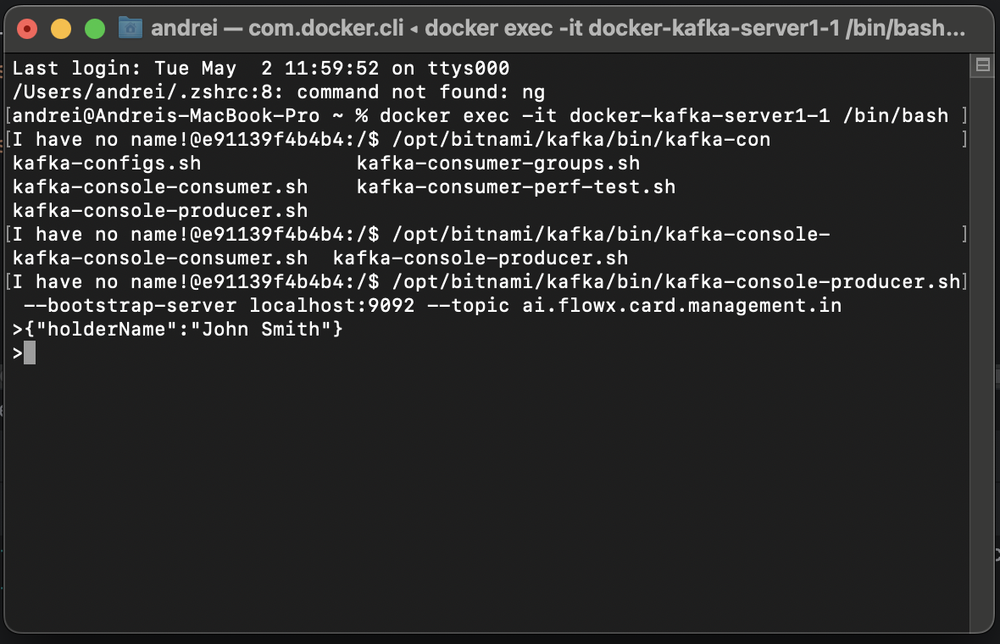
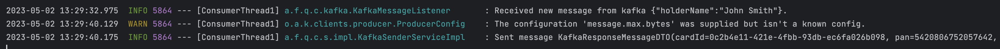
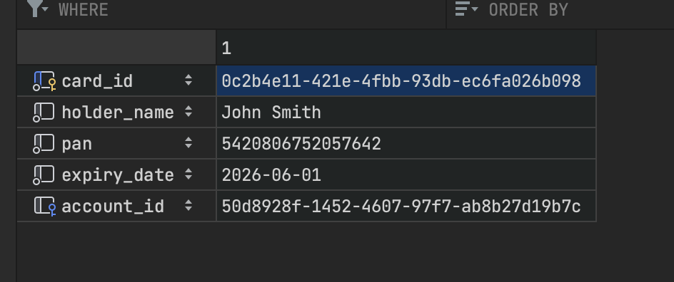

## FLOWX Legacy Card Management connector

#### 1. Legacy card management api definitions
- https://dev-legacy-card.outmost.ro/swagger

#### 2. Kafka message tests
- message sent
``` json
{
    "holderName": "John Smith"
}
```



- log



- queried table



- kafka response message
``` json
{
    "cardId": "0c2b4e11-421e-4fbb-93db-ec6fa026b098",
    "pan": "5420806752057642",
    "expiryDate": 1780272000000,
    "accountIBAN": "RO55ROIN0088268967648685",
    "errorMessage": null
}
```